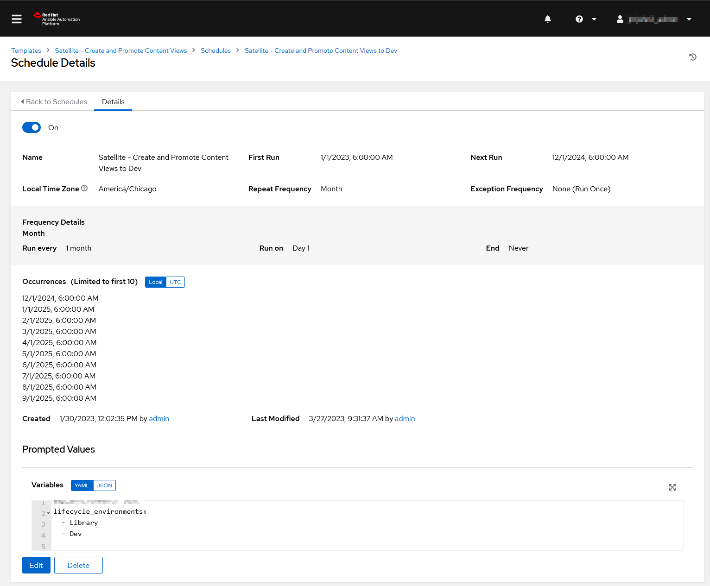
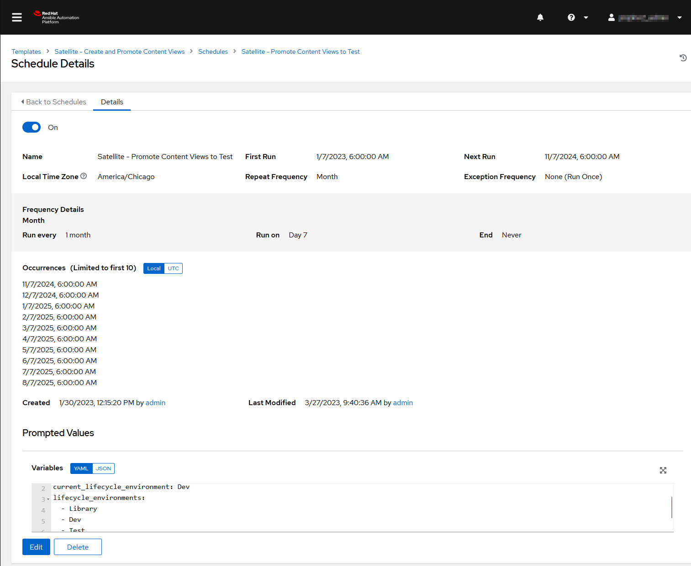

# Satellite - Content Views

This repository contains an Ansible playbook designed to automate the publishing and promotion of Content Views in Red Hat Satellite. The playbook supports both production and test environments and is intended to be run within Ansible Automation Platform (AAP) or AWX.

## Overview

The Ansible playbook automates the process of publishing and promoting Content Views in Red Hat Satellite. It iterates over a list of specified Content Views (e.g., `RHEL 7 Base`, `RHEL 8 Base`, `RHEL 9 Base`) and promotes them through defined lifecycle environments.

## Prerequisites

- **Ansible Automation Platform (AAP) or AWX**: The playbook is designed to run within AAP or AWX.
- **Red Hat Satellite**: Access to a configured Red Hat Satellite server.
- **Ansible Collections**:
    - `redhat.satellite`
## Configuration

### Variables

Variables are defined in the `vars/` directory for different environments:

- `prod.yml`: Variables for the production environment.
- `test.yml`: Variables for the test environment.

These variable files include essential parameters such as:

- `satellite_username`: Satellite admin username.
- `satellite_password`: Satellite admin password.
- `satellite_server_url`: URL of the Satellite server.
- `lifecycle_environments`: List of lifecycle environments to promote the Content Views.
- `current_lifecycle_environment` (optional): The current lifecycle environment of the Content View.

**Note**: These variable files are vaulted for security reasons.
## Usage

The playbook performs the following task:

- **Publish and Promote Content Views**:
    - Uses the `redhat.satellite.content_view_version` module to publish and promote specified Content Views.
    - Iterates over a list of Content Views (e.g., `RHEL 7 Base`, `RHEL 8 Base`, `RHEL 9 Base`).
    - Promotes the Content Views through the lifecycle environments defined in `lifecycle_environments`.
    - To Promote, specify the current lifecycle environment if required.
    - To Publish, omit current_lifecycle_environment.

- **Make Schedules in AAP**
    - Create and Promote Content View to Dev
    
    - Promote Content Views to Test
    
    - Repeat for Production use

## License

MIT License